# IDE Setup for ESP32 Micro-controller

## Installing the ESP32 Board in Arduino IDE (Windows, Mac OS X, Linux)
---

There's an add-on for the Arduino IDE that allows you to program the ESP32 using the Arduino IDE and its programming language. In this tutorial we’ll show you how to install the ESP32 board in Arduino IDE whether you’re using Windows, Mac OS X or Linux.

If you have any problems during the installation procedure, take a look at the ESP32 Troubleshooting Guide.

### Step 1
#### Installing IDE

- Before starting this installation procedure, you need to have Arduino IDE installed on your computer. There are two versions of the Arduino IDE you can install: version 1 and version 2.

You can download and install Arduino IDE by clicking on the following link:
https://www.arduino.cc/en/software

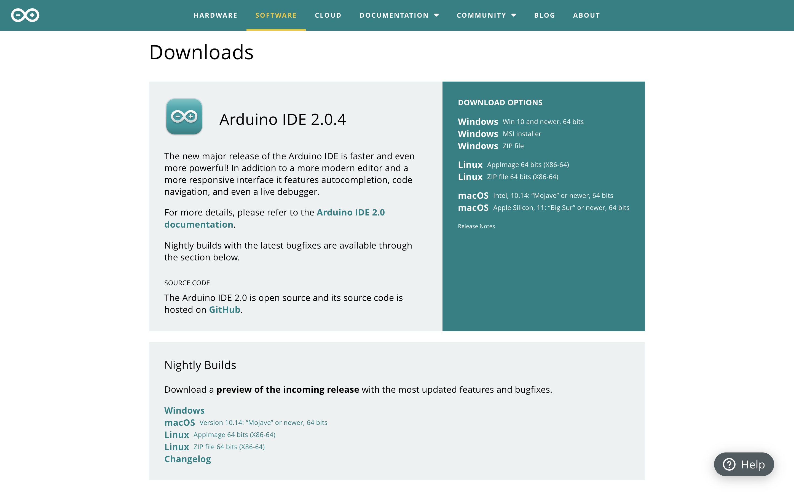

| <b>IDE - Choose your IDE according to your Operating System</b> |
- (Since I'm using Mac, I'll be downloading and continuing this tutorial in MacOS.)

### Step 2
####  Installing ESP32 Board on your IDE 

- In your Arduino IDE, go to File> Settings

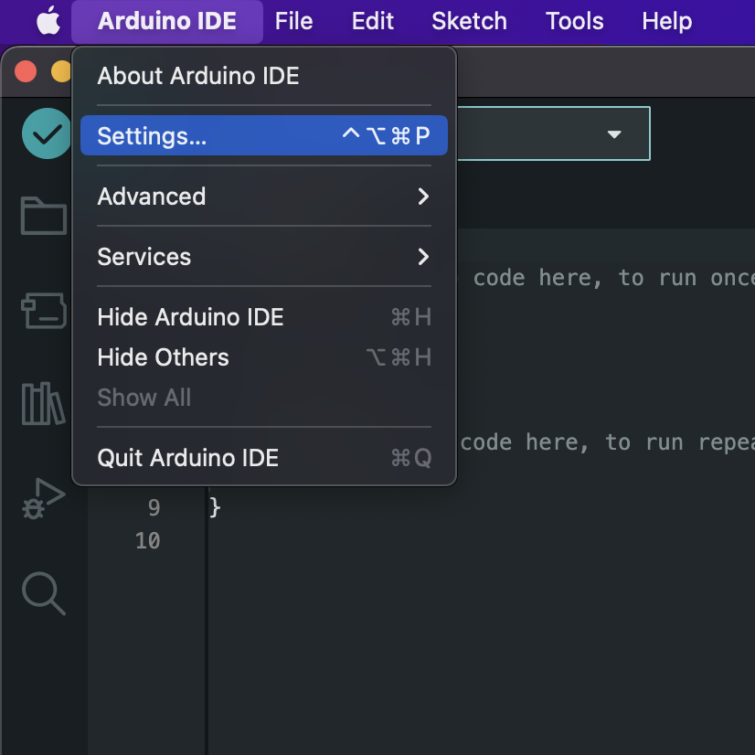

- Enter the following into the “Additional Board Manager URLs” field:

`https://raw.githubusercontent.com/espressif/arduino-esp32/gh-pages/package_esp32_index.json`
> https://raw.githubusercontent.com/espressif/arduino-esp32/gh-pages/package_esp32_index.json

- And hit "ok"

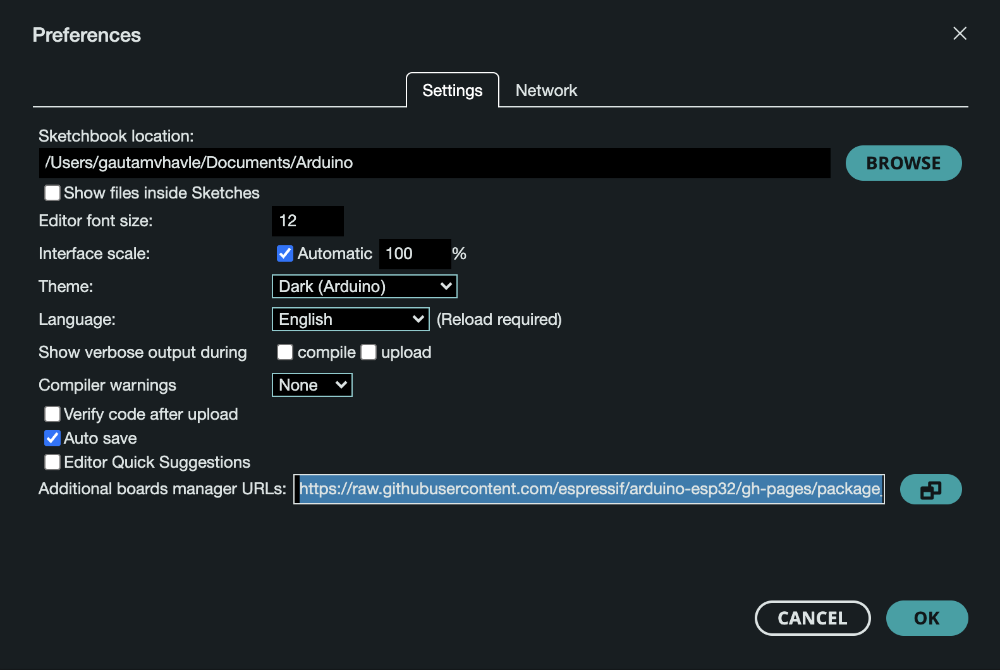

- Open the Boards Manager. Go to Tools > Board > Boards Manager…

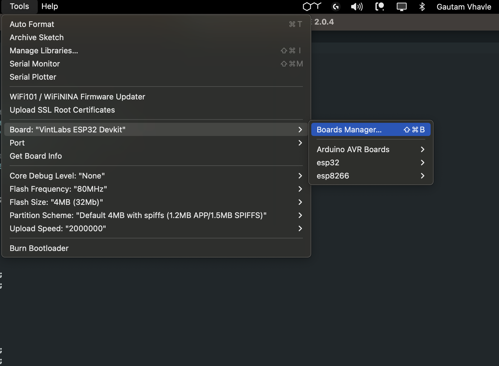

- Search for ESP32 and press install button for the “ESP32 by Espressif Systems“:

### Step 3

####  Testing the Installation

Plug the ESP32 board to your computer. With your Arduino IDE open, follow these steps:

- Select your Board in Tools > Board menu (in my case it’s the "VintLabs ESP32 Devkit").

- In your Arduino IDE, go to File> Settings

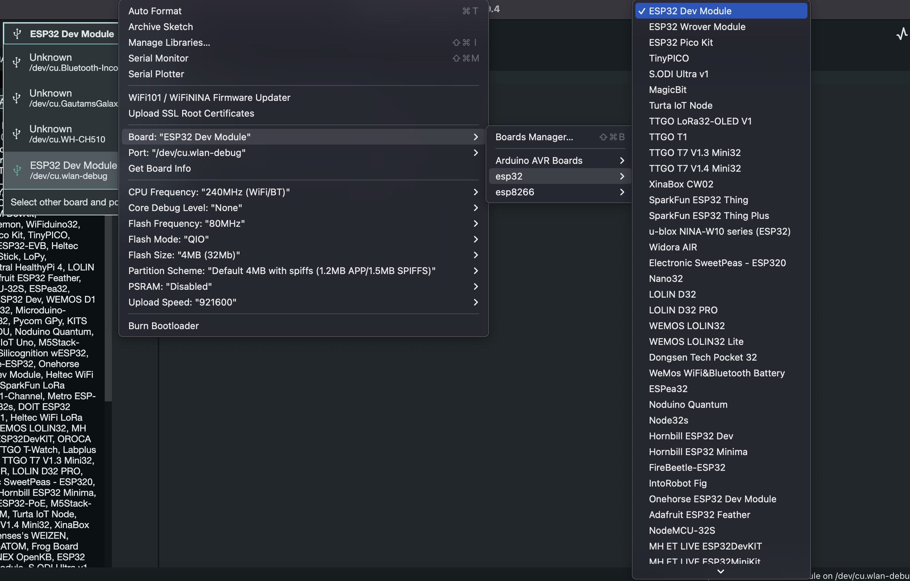

- Select the Port

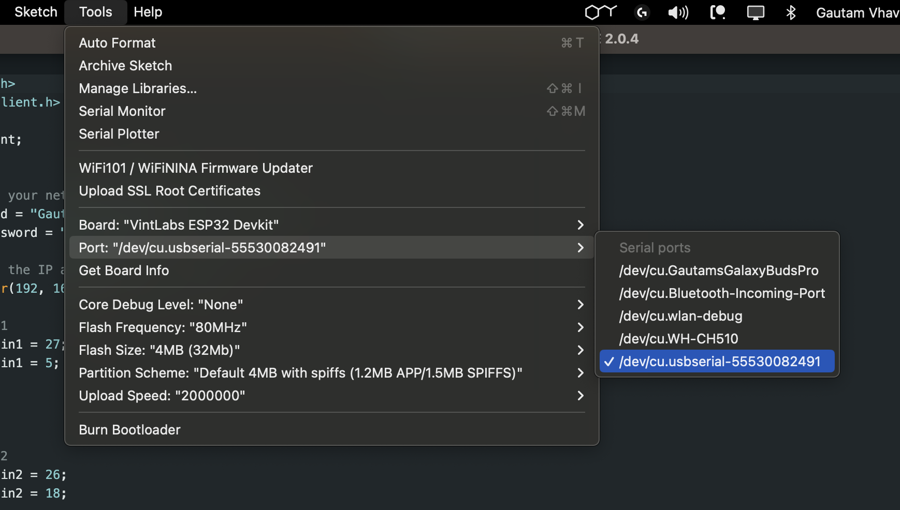

- Open the following example under File > Examples > WiFi (ESP32) > WiFiScan

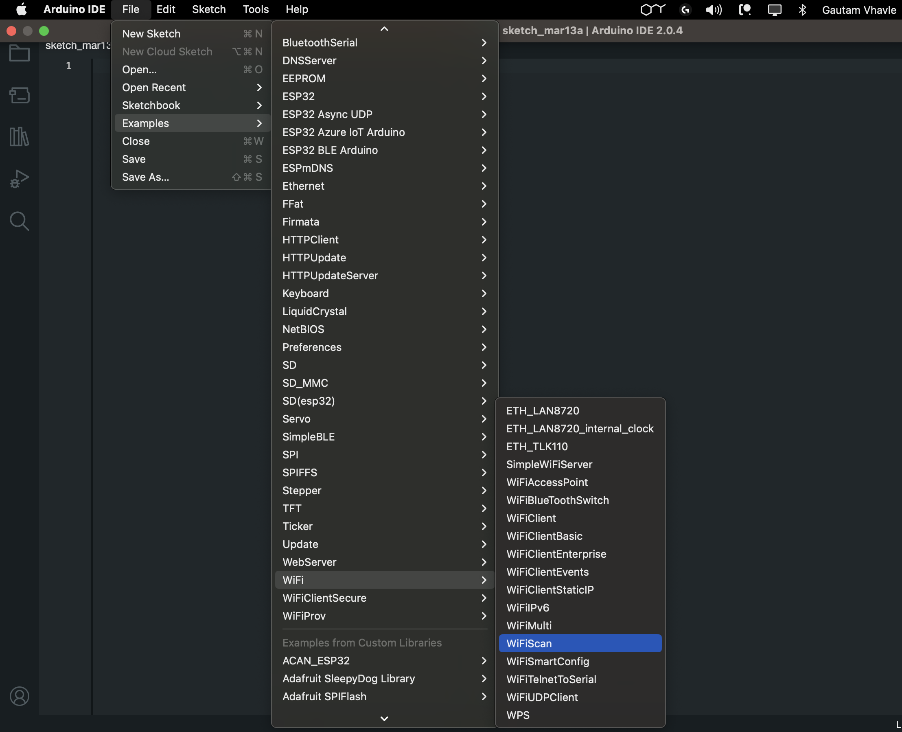

- A new sketch opens in your Arduino IDE:

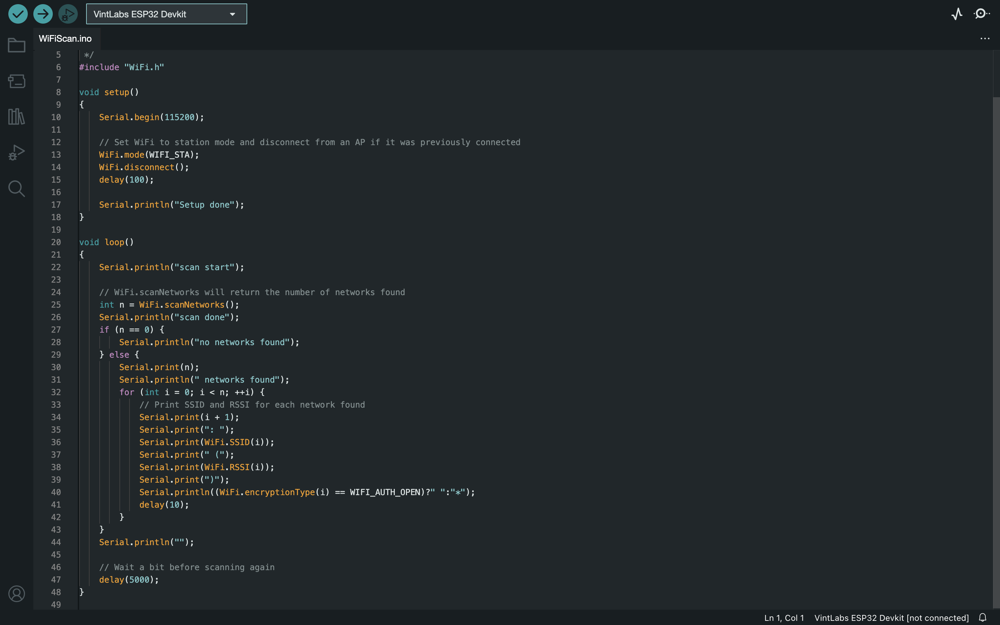

- Press the Upload button in the Arduino IDE. Wait a few seconds while the code compiles and uploads to your board.

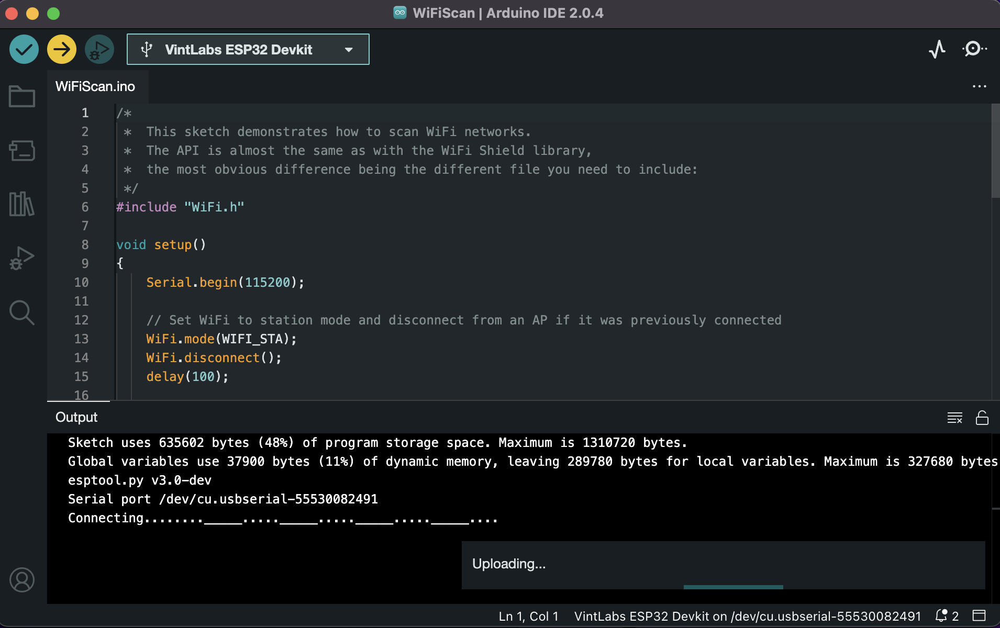

- If everything went as expected, you should see a “Done uploading.” message.

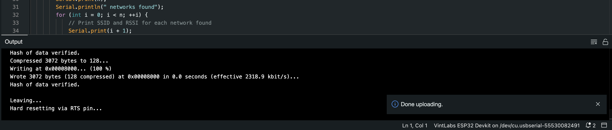

- Open the Arduino IDE Serial Monitor at a baud rate of 115200 and Press the ESP32 on-board Enable button and you should see the networks available near your ESP32:

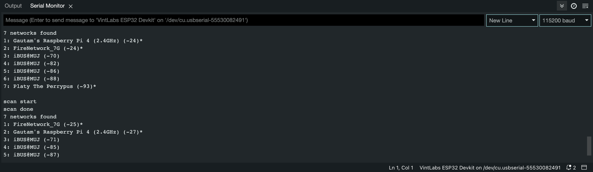

 This is a quick guide that illustrates how to prepare your Arduino IDE for the ESP32 on a Windows PC, Mac OS X, or Linux computer. If you encounter any issues during the installation procedure, take a look at the ESP32 troubleshooting guide.

### The End