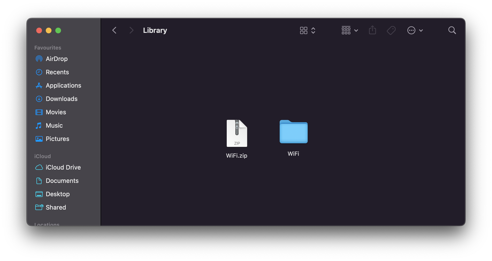
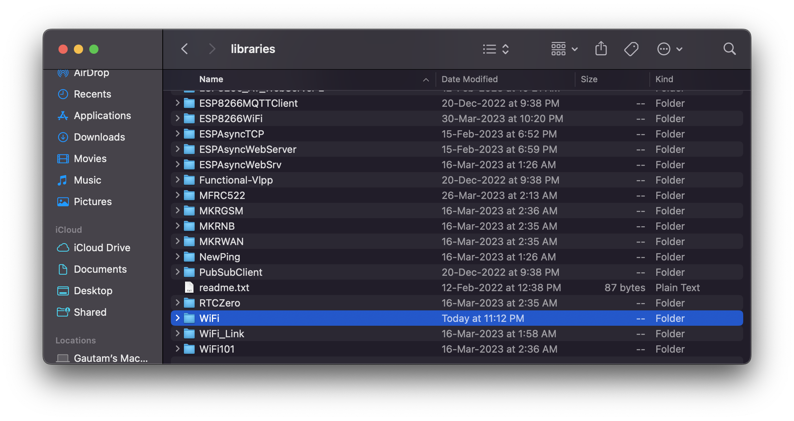
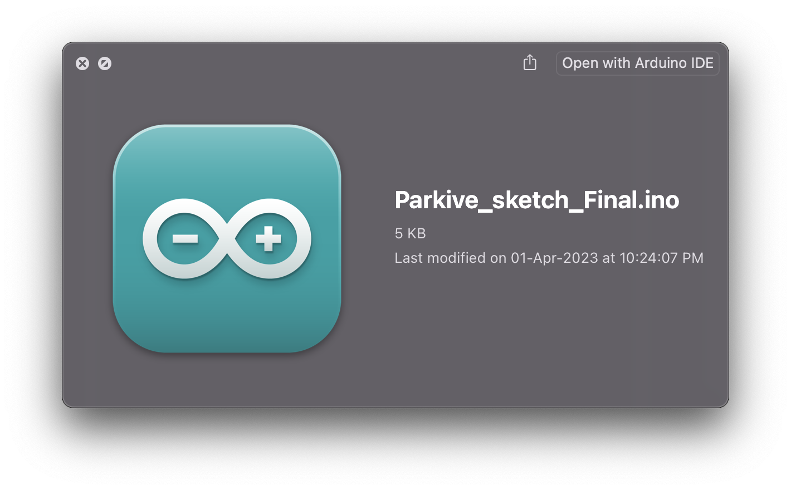
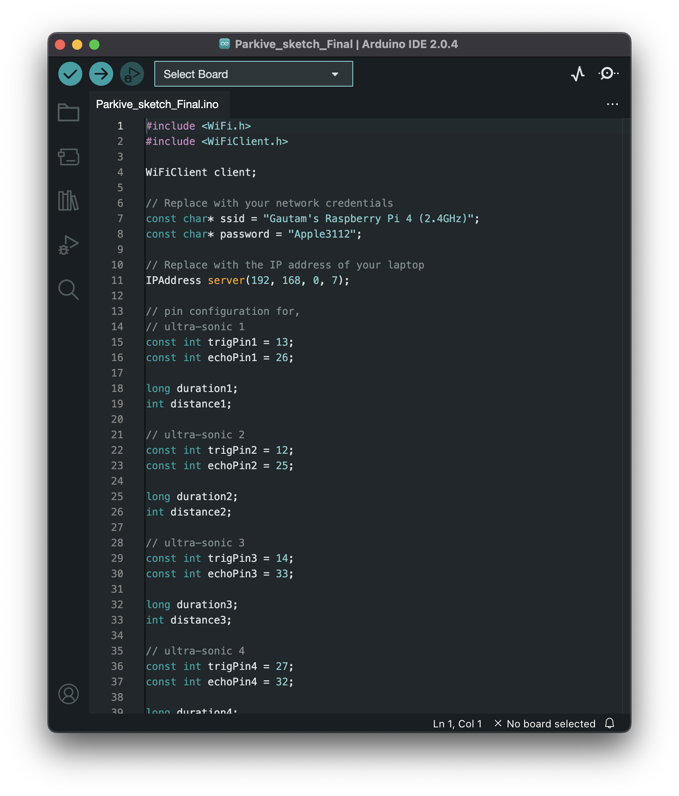
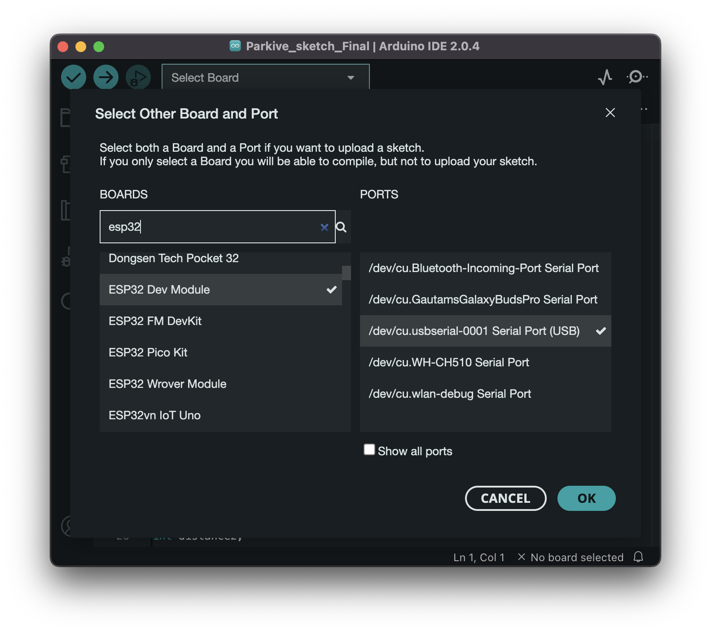
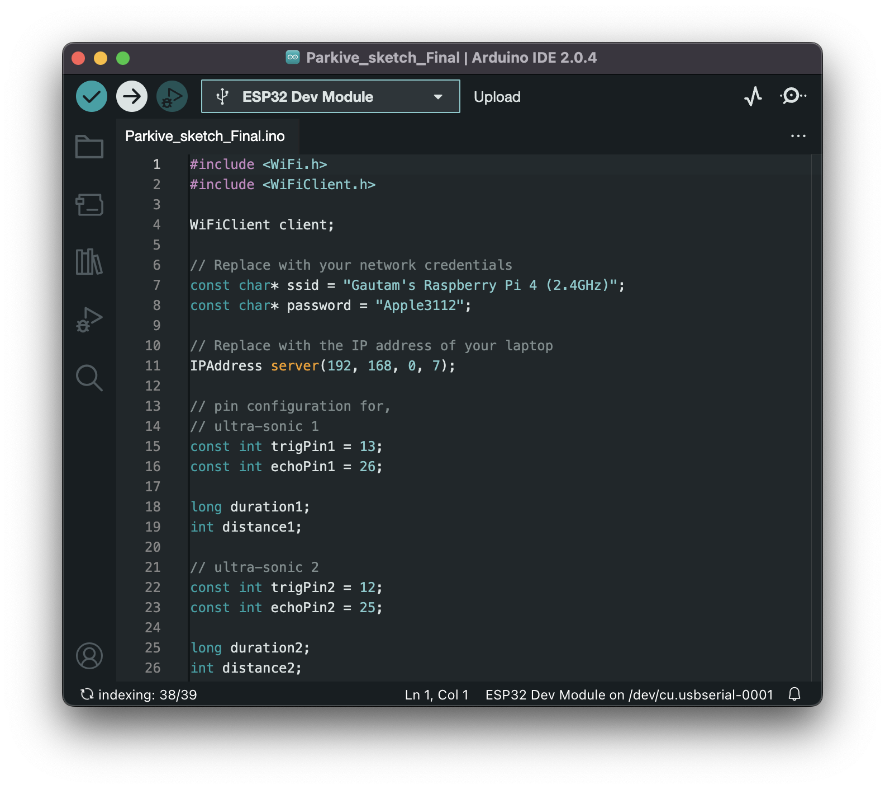

# Hardware Setup for the Project

## Uploading the code on the ESP32 Board from Arduino IDE
---
We shall a library to our Arduino sketch for flashing on ESP8266 module, you can do so by either using the Arduino IDE's built-in Library Manager or by manually adding the library files to your Arduino libraries folder. In this guide, we'll see how to manually add library.

## Step 1
#### Downloading library

- Download the WIFI library which want to use from the our git repo. The library are in a compressed format.

## Step 2
#### Decompressing library

Extract the library files to a folder on your computer.

Rename the extracted folder to the name of the library (remove any version numbers or other information from the folder name).

## Step 3
#### Adding it in Audrino library

- Move the renamed folder to your Arduino "libraries" folder. The location of this folder will depend on your operating system:

- On Windows, it is usually located at "My Documents\Arduino\libraries".
- On macOS, it is usually located at "/Users/{username}/Documents/Arduino/libraries".
On Linux, it is usually located at "~/Arduino/libraries".

Restart the Arduino IDE to ensure that it recognizes the new library.

## Step 4
#### including Audrino library

In your sketch, include the library by adding the following line at the beginning of your code: #include <Wifi.h>, where "LibraryName" is the name of the library you downloaded.

Again, be sure to check the library's documentation for any additional steps that may be required for using the library with the ESP8266 module.

---

# Now let's begin flashing the sketch
### Let's call this "The Last Step"

From here on we will be seeing how to flash our sketch file on our esp32.

## Step 1
#### #Downloading Sketch

- Download the sketch from the our Git repo, https://github.com/shubhamistic/parkive and place it in a new desirable folder.

## Step 2
#### #Opening the sketch in your Arduino IDE

 You have succesfully opened the sketch file, Now we are ready to launch our sketch to our Micorcontroller (esp8266)

## Step 3
#### #Flashing

 Select your Board and Serial Port and tap "OK".

Ready to launch

 

 Uploading...

 Uploaded 🚀

---
# The End