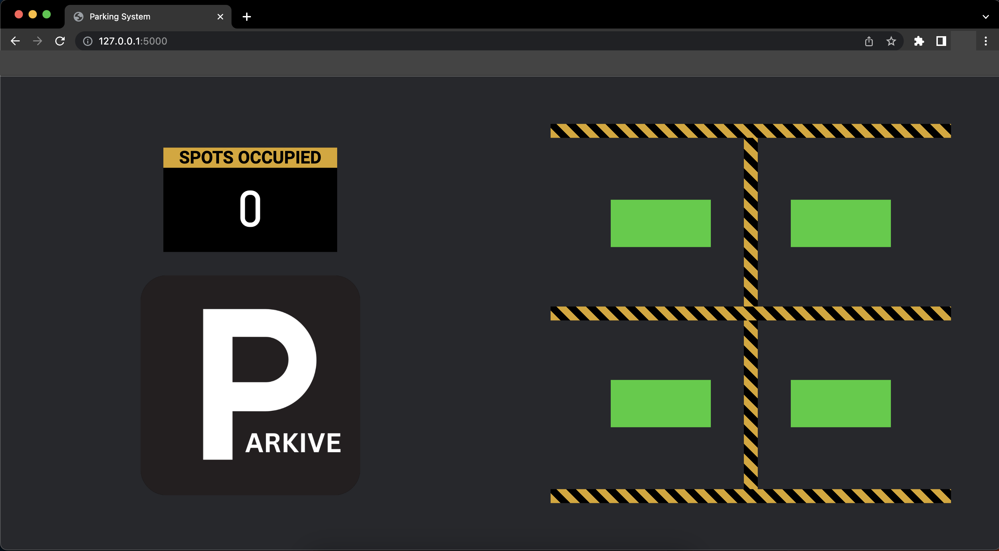

## Server Installation

Open the project folder using: 

```
$ cd parkive-main
```

Install requirements using pip:

```
$ pip install -r requirements.txt
```

Run the server:

```
$ python3 app.py
```

### Click on the pointed URL to run the parking monitoring webpage


### Monitor the parking status in real time


